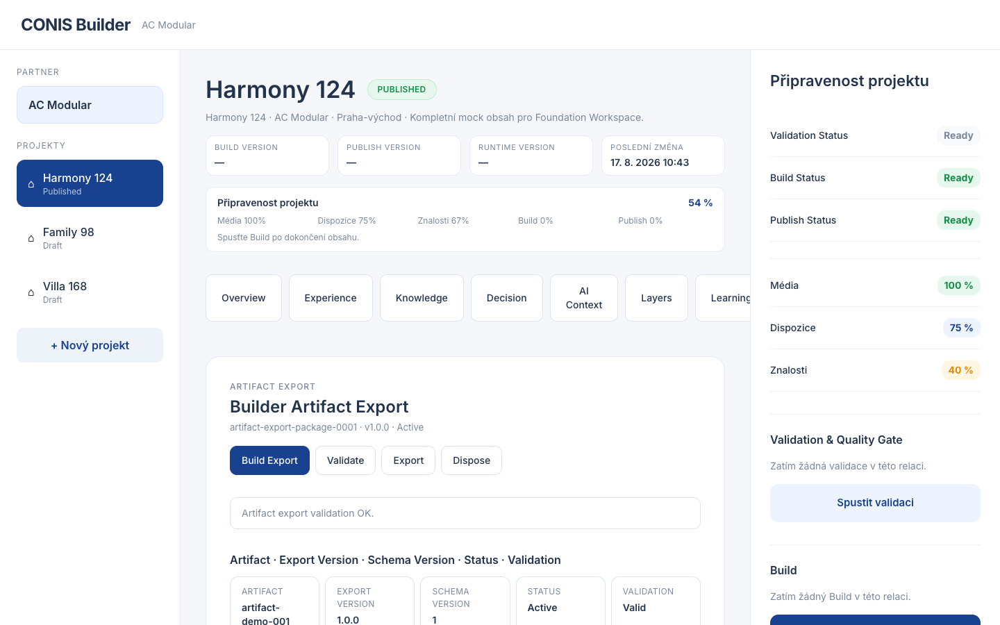

# EPIC-BLD-65 — Artifact Export Contract Report

## Components

| Component | Status |
|---|---|
| ArtifactExportContract | PASS |
| ArtifactExportModel | PASS |
| ArtifactExportPackage | PASS |
| ArtifactExportStrategy (BasicArtifactExportStrategy) | PASS |
| ArtifactExportValidator | PASS |
| ArtifactExportIndex | PASS |
| Artifact Export Overview | PASS |
| Artifact Export Events | PASS |
| Artifact Export API | PASS |

## Build

```
vite build — OK (dist/assets/index-CKPq5AfI.js 1176 kB)
```

## Typecheck

```
tsc --noEmit — 0 errors
```

## Tests

```
9 tests, 9 pass, 0 fail
- initializes and builds a deterministic export model
- validates a built export model
- exports and marks status as Exported
- produces deterministic export model IDs for same input
- records events for build, validate, export
- lists and finds artifact exports
- disposes artifact export package
- rejects export of invalid model
- maintains index entries
```

## Screenshot



## Models

- `ArtifactExportModel` — id, artifactId, artifactType, exportVersion, schemaVersion, metadata (title, notes, status)
- `ArtifactExportPackage` — id, version, exportModel, createdAt, updatedAt, metadata, validation
- `ArtifactExportValidation` — valid, issues, validatedAt
- `ArtifactExportValidationIssue` — code, severity, message
- `ArtifactExportIndexEntry` — packageId, artifactId, artifactType, exportVersion, schemaVersion, status

## Events

- `ArtifactExportBuilt`
- `ArtifactExportValidated`
- `ArtifactExportPublished`
- `ArtifactExportInvalidated`

## API

- `buildArtifactExport(packageId, input, init?)` — build or initialize + build
- `exportArtifact(packageId)` — validate and export
- `listArtifactExports()` — list all export models
- `findArtifactExport(artifactId)` — find by artifact ID
- `validateArtifactExport(packageId)` — validate export contract
- `disposeArtifactExport(packageId)` — dispose package

## Architectural Notes

- Export model identity is deterministic: `export-{artifactId}-{exportVersion}-{schemaVersion}`
- Same input always produces the same export model ID
- Validator never mutates the export, only evaluates
- No deployment, serialization, transport, synchronization, or AI
- Follows established Builder Studio service pattern (Strategy, Validator, Index, Contract, API)

## Deviations

None.
