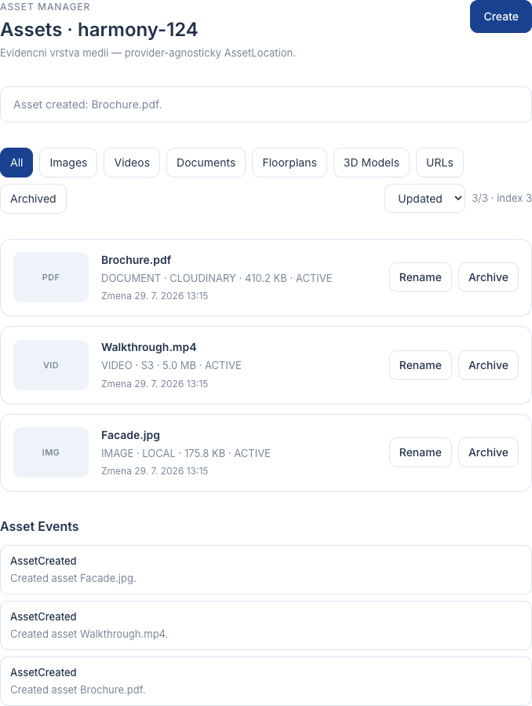

# EPIC-BX-03 — Asset Manager Report

## Scope

Implemented the central Asset Manager as a provider-agnostic registry layer.

Asset Manager is the Single Source of Truth for project media identity, location and metadata.

It manages:

- images
- videos
- documents
- floorplans
- 3D models
- external URLs
- future media types (`OTHER`)

It does not upload, transform, generate previews, optimize, publish, or use AI.

## Delivered Components

| Component | Status |
|---|---|
| AssetService (`AssetManagerService`) | PASS |
| Asset model | PASS |
| AssetLocation model | PASS |
| AssetPackage | PASS |
| AssetStrategy | PASS |
| BasicAssetStrategy | PASS |
| AssetValidator | PASS |
| AssetIndex | PASS |
| Assets UI | PASS |
| Events | PASS |
| API | PASS |

## AssetLocation

Independent of any concrete storage backend:

- `provider` (`LOCAL` | `CLOUDINARY` | `S3` | `URL` | `OTHER`)
- `uri`
- `bucket`
- `key`
- `metadata`

## Service / API

- `initialize()`
- `createAsset()`
- `updateAsset()`
- `archiveAsset()`
- `restoreAsset()`
- `findAsset()`
- `listAssets()`
- `listProjectAssets()`
- `listAssetsByType()`
- `dispose()`

## Events

- `AssetCreated`
- `AssetUpdated`
- `AssetArchived`
- `AssetRestored`
- `AssetMetadataChanged`

## UI

Section: `Assets`

Each row shows:

- preview hint
- name
- type
- provider
- size
- updated date
- status

Actions:

- Create
- Rename
- Archive
- Restore

Filters:

- Images / Videos / Documents / Floorplans / 3D Models / URLs / Archived

Sort:

- Name / Updated / Type / Provider

## Validation Notes

- asset ids are unique and deterministic within a service instance
- an asset belongs to exactly one project
- `AssetLocation` keeps storage concerns out of the Asset model
- archive keeps data (`ARCHIVED`); restore returns `ACTIVE`
- no operation mutates binary content
- index rebuild returns deterministic sorted results

## Verification

```text
npx tsc --noEmit
PASS

npx tsx --test src/services/asset-manager/asset-manager-service.test.ts
PASS

npx vite build
PASS

npm test
PASS
```

## Screenshot


