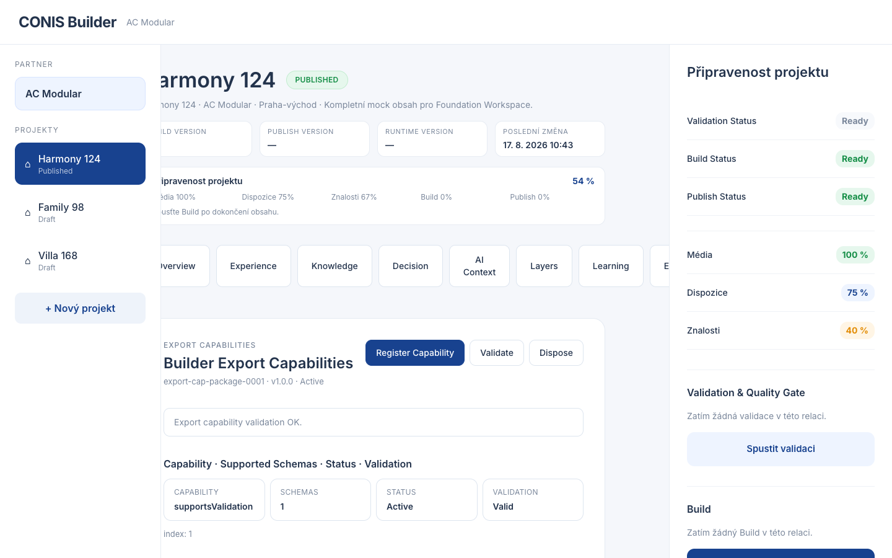

# EPIC-BLD-68 — Export Capability Registry Report

## Components

| Component | Status |
|---|---|
| ExportCapabilityRegistry | PASS |
| ExportCapability | PASS |
| ExportCapabilityPackage | PASS |
| BasicExportCapabilityStrategy | PASS |
| ExportCapabilityValidator | PASS |
| ExportCapabilityIndex | PASS |
| Export Capabilities Overview | PASS |
| Export Capability Events | PASS |
| Export Capability API | PASS |

## Build

```
vite build — OK
```

## Typecheck

```
tsc --noEmit — 0 errors
```

## Tests

```
8 tests, 8 pass, 0 fail
```

## Screenshot



## Models

- `ExportCapability` — id, name, description, supportedSchemaVersions[], status, metadata
- `ExportCapabilityPackage` — id, version, capabilities[], createdAt/updatedAt, metadata, validation
- `ExportCapabilityValidation` — valid, issues, validatedAt
- `ExportCapabilityIndexEntry` — packageId, capabilityId, name, supportedSchemaVersions[], status

## Events

- `ExportCapabilityRegistered`
- `ExportCapabilityValidated`
- `ExportCapabilityDeprecated`
- `ExportCapabilityRemoved`

## API

- `registerExportCapability(packageId, input, init?)`
- `findExportCapability(name)`
- `listExportCapabilities()`
- `validateExportCapability(packageId)`
- `disposeExportCapability(packageId)`

## Architectural Notes

- Registry stores only metadata; it never transforms/exportes artifacts.
- Validator evaluates capabilities without mutating them.
- Deterministic lookup via in-memory index filtering.
- No Runtime execution, no serialization/transports, no AI.

## Deviations

None.

