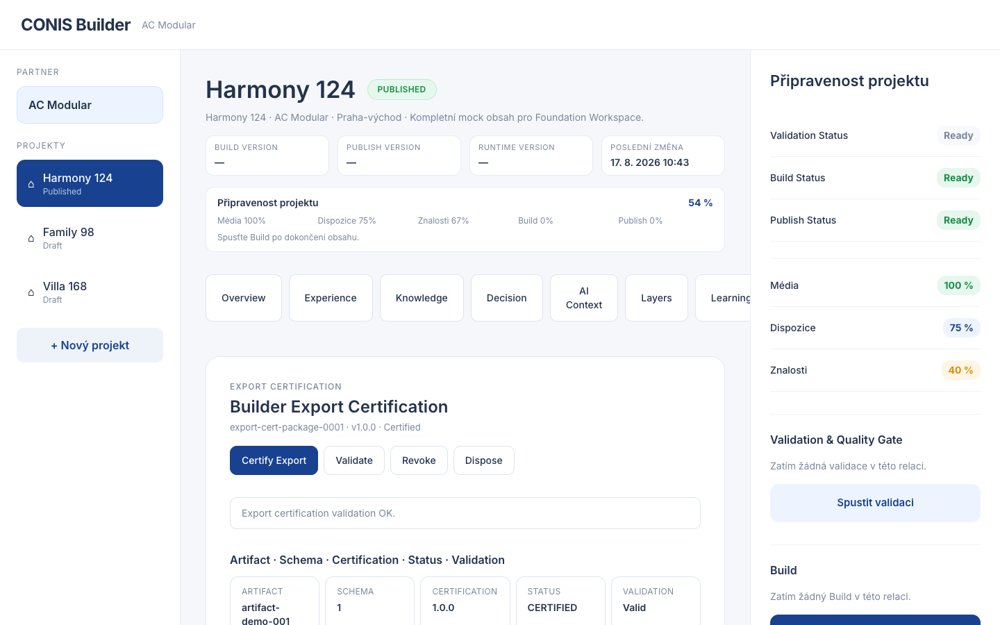

# EPIC-BLD-70 — Export Certification Service Report

## Components

| Component | Status |
|---|---|
| ExportCertificationService | PASS |
| ExportCertificate | PASS |
| ExportCertificationPackage | PASS |
| BasicExportCertificationStrategy | PASS |
| ExportCertificationValidator | PASS |
| ExportCertificationIndex | PASS |
| Export Certification Overview | PASS |
| Export Certification Events | PASS |
| Export Certification API | PASS |

## Build

```text
vite build — OK
```

## Typecheck

```text
tsc --noEmit — 0 errors
```

## Tests

```text
7 tests, 7 pass, 0 fail
```

## Screenshot



## Models

- `ExportCertificate` — id, artifactId, schemaVersion, certificationVersion, status, issuedAt, metadata
- `ExportCertificationPackage` — id, version, certificate, createdAt/updatedAt, metadata, validation
- `ExportCertificationValidation` — valid, issues, validatedAt
- `ExportCertificationIndexEntry` — packageId, certificateId, artifactId, schemaVersion, certificationVersion, status

## Events

- `ExportCertified`
- `ExportCertificationValidated`
- `ExportCertificationRevoked`
- `ExportCertificationExpired`

## API

- `certifyExport(packageId, input, init?)`
- `findExportCertificate(artifactId)`
- `listExportCertificates()`
- `validateExportCertification(packageId)`
- `revokeExportCertification(packageId)`
- `disposeExportCertification(packageId)`

## Architectural Notes

- Service issues readiness certificates without mutating export payloads.
- Certification is deterministic for the same input structure inside the service pattern used here.
- Validator checks policy/capability/compatibility/integrity dimensions as metadata validation only.
- No deployment, no publishing, no Runtime execution, no AI.

## Deviations

None.

