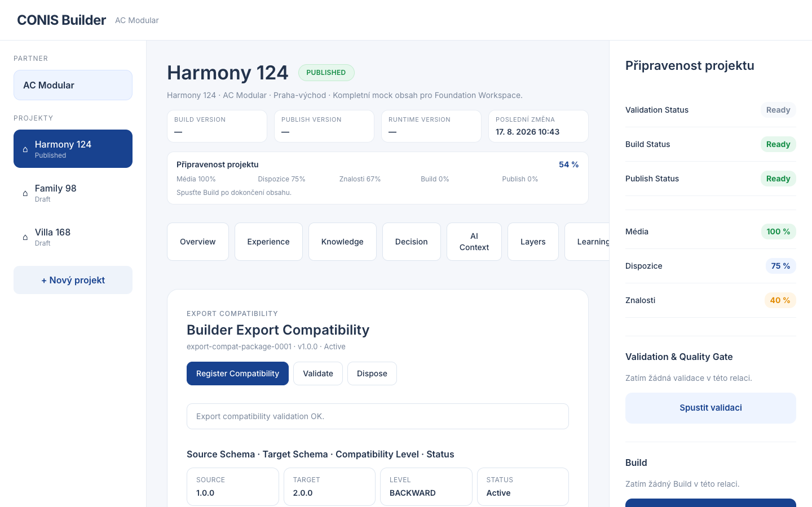

# EPIC-BLD-67 — Export Compatibility Registry Report

## Components

| Component | Status |
|---|---|
| ExportCompatibilityRegistry | PASS |
| ExportCompatibility | PASS |
| ExportCompatibilityPackage | PASS |
| ExportCompatibilityStrategy (BasicExportCompatibilityStrategy) | PASS |
| ExportCompatibilityValidator | PASS |
| ExportCompatibilityIndex | PASS |
| Export Compatibility Overview | PASS |
| Export Compatibility Events | PASS |
| Export Compatibility API | PASS |

## Build

```
vite build — OK
```

## Typecheck

```
tsc --noEmit — 0 errors
```

## Tests

```
11 tests, 11 pass, 0 fail
- initializes and registers a compatibility entry
- supports multiple compatibility levels
- validates registered compatibilities
- finds compatibility by source version
- deprecates a compatibility entry
- removes a compatibility entry
- records events
- disposes a package
- maintains index entries
- rejects empty source version
- warns about same source and target version in validation
```

## Screenshot



## Models

- `ExportCompatibility` — id, sourceSchemaVersion, targetSchemaVersion, compatibilityLevel (FULL/BACKWARD/FORWARD/INCOMPATIBLE), status, metadata
- `ExportCompatibilityPackage` — id, version, compatibilities[], createdAt, updatedAt, metadata, validation
- `ExportCompatibilityValidation` — valid, issues, validatedAt
- `ExportCompatibilityIndexEntry` — packageId, compatibilityId, sourceSchemaVersion, targetSchemaVersion, compatibilityLevel, status

## Events

- `ExportCompatibilityRegistered`
- `ExportCompatibilityValidated`
- `ExportCompatibilityDeprecated`
- `ExportCompatibilityRemoved`

## API

- `registerExportCompatibility(packageId, input, init?)` — register or initialize + register
- `findExportCompatibility(sourceVersion)` — find by source schema version
- `listExportCompatibilities()` — list all compatibility entries
- `validateExportCompatibility(packageId)` — validate consistency (duplicate pairs, identical versions)
- `deprecateExportCompatibility(packageId, compatibilityId)` — mark as Deprecated
- `removeExportCompatibility(packageId, compatibilityId)` — mark as Removed

## Architectural Notes

- Supports all four compatibility levels: FULL, BACKWARD, FORWARD, INCOMPATIBLE
- Validator detects identical source/target versions and duplicate pairs
- Search is deterministic
- Validator never mutates registered entries
- No migrations, transformations, serialization, deployment, or AI

## Deviations

None.
