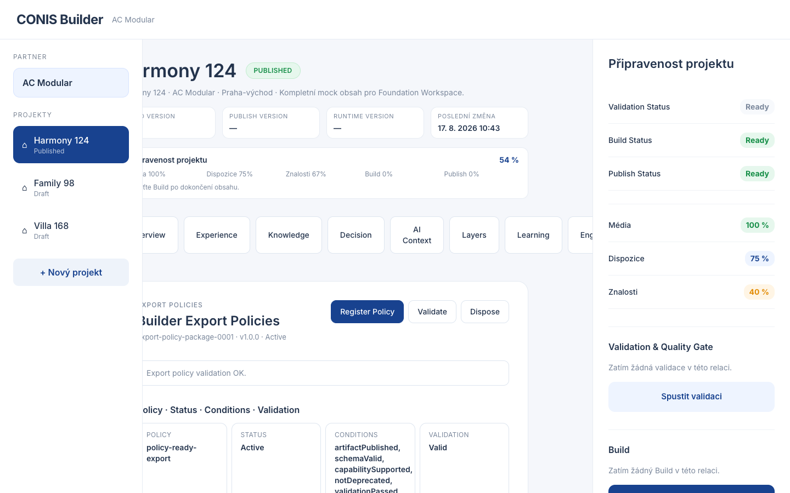

# EPIC-BLD-69 — Export Policy Registry Report

## Components

| Component | Status |
|---|---|
| ExportPolicyRegistry | PASS |
| ExportPolicy | PASS |
| ExportPolicyPackage | PASS |
| BasicExportPolicyStrategy | PASS |
| ExportPolicyValidator | PASS |
| ExportPolicyIndex | PASS |
| Export Policies Overview | PASS |
| Export Policy Events | PASS |
| Export Policy API | PASS |

## Build

```text
vite build — OK
```

## Typecheck

```text
tsc --noEmit — 0 errors
```

## Tests

```text
7 tests, 7 pass, 0 fail
```

## Screenshot



## Models

- `ExportPolicy` — id, name, conditions[], status, metadata
- `ExportPolicyPackage` — id, version, policies[], createdAt/updatedAt, metadata, validation
- `ExportPolicyValidation` — valid, issues, validatedAt
- `ExportPolicyIndexEntry` — packageId, policyId, name, conditions[], status

## Events

- `ExportPolicyRegistered`
- `ExportPolicyValidated`
- `ExportPolicyDeprecated`
- `ExportPolicyRemoved`

## API

- `registerExportPolicy(packageId, input, init?)`
- `findExportPolicy(name)`
- `listExportPolicies()`
- `validateExportPolicy(packageId)`
- `disposeExportPolicy(packageId)`

## Architectural Notes

- Registry stores only policy metadata; it does not enforce export behavior.
- Validator evaluates conditions, metadata and integrity without mutating policies.
- Lookup is deterministic via in-memory index filtering by policy name.
- No Runtime execution, no deployment, no transformations, no AI.

## Deviations

None.

