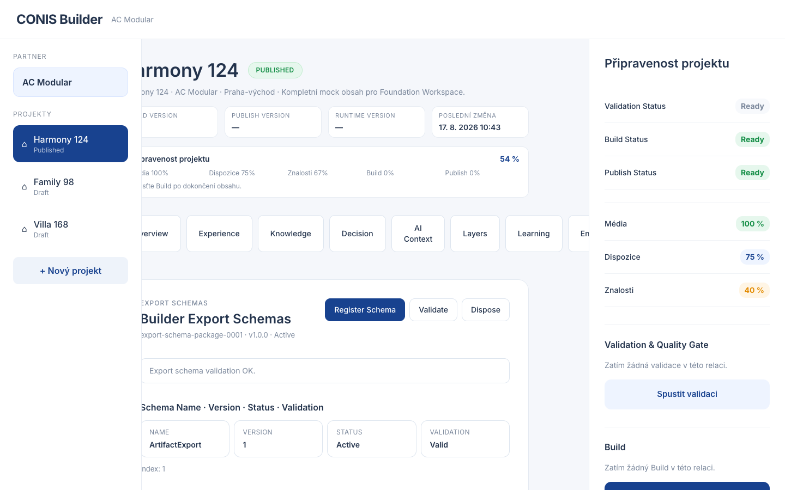

# EPIC-BLD-66 — Export Schema Registry Report

## Components

| Component | Status |
|---|---|
| ExportSchemaRegistry | PASS |
| ExportSchema | PASS |
| ExportSchemaPackage | PASS |
| ExportSchemaStrategy (BasicExportSchemaStrategy) | PASS |
| ExportSchemaValidator | PASS |
| ExportSchemaIndex | PASS |
| Export Schemas Overview | PASS |
| Export Schema Events | PASS |
| Export Schema API | PASS |

## Build

```
vite build — OK
```

## Typecheck

```
tsc --noEmit — 0 errors
```

## Tests

```
10 tests, 10 pass, 0 fail
- initializes and registers a schema
- registers multiple versions of the same schema
- validates registered schemas
- finds schemas by name
- deprecates a schema
- removes a schema
- records events
- disposes a package
- maintains index entries
- rejects empty name
```

## Screenshot



## Models

- `ExportSchema` — id, name, schemaVersion, status (Active/Deprecated/Removed), metadata
- `ExportSchemaPackage` — id, version, schemas[], createdAt, updatedAt, metadata, validation
- `ExportSchemaValidation` — valid, issues, validatedAt
- `ExportSchemaIndexEntry` — packageId, schemaId, name, schemaVersion, status

## Events

- `ExportSchemaRegistered`
- `ExportSchemaValidated`
- `ExportSchemaDeprecated`
- `ExportSchemaRemoved`

## API

- `registerExportSchema(packageId, input, init?)` — register or initialize + register
- `findExportSchema(name)` — find schemas by name (supports multiple versions)
- `listExportSchemas()` — list all registered schemas
- `validateExportSchema(packageId)` — validate all schemas in package
- `deprecateExportSchema(packageId, schemaId)` — mark schema as Deprecated
- `removeExportSchema(packageId, schemaId)` — mark schema as Removed

## Architectural Notes

- Registry supports multiple versions of the same schema name
- Search is deterministic — same input always returns same results
- Validator never mutates registered schemas, only evaluates
- No migrations, transformations, serialization, deployment, or AI
- Follows established Builder Studio service pattern

## Deviations

None.
