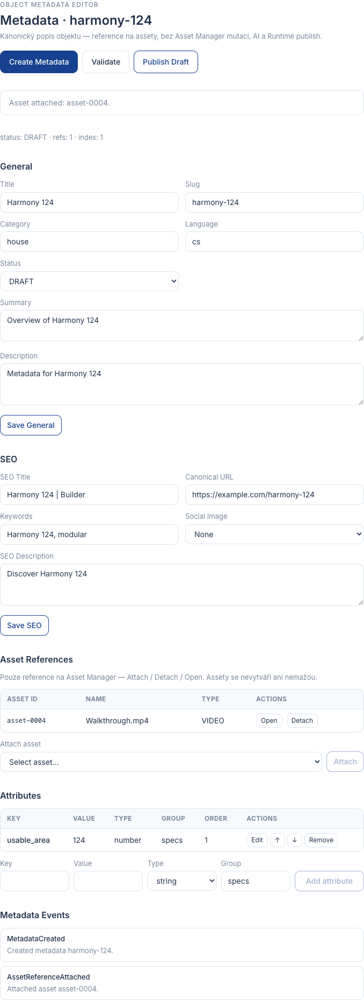

# EPIC-BX-04 — Object Metadata Editor Report

## Scope

Implemented Object Metadata Editor as the canonical description layer for a Builder project.

Metadata are the single source of truth for object description. They do not contain presentation logic.

They prepare the object for:

- Validation Dashboard (BX-05)
- Publish flows
- Runtime packaging (later EPICs)
- Search / SEO consumers

## Model note

The editor document type is exported as `ObjectMetadataDocument` to avoid collision with the existing Object Package authoring type `ObjectMetadata` (`object-types.ts`).

Epic deliverable `ObjectMetadata` ≡ `ObjectMetadataDocument`.

`MetadataStatus` is the canonical status union (`DRAFT` | `READY` | `PUBLISHED` | `ARCHIVED`).

## Delivered Components

| Component | Status |
|---|---|
| MetadataService | PASS |
| ObjectMetadata (`ObjectMetadataDocument`) | PASS |
| MetadataStatus | PASS |
| SeoMetadata | PASS |
| ObjectAttribute | PASS |
| MetadataPackage | PASS |
| MetadataStrategy | PASS |
| BasicMetadataStrategy | PASS |
| MetadataValidator | PASS |
| MetadataIndex | PASS |
| Metadata UI | PASS |
| Events | PASS |
| API | PASS |
| Unit tests | PASS |

## Service API

- `initialize()`
- `createMetadata()`
- `updateMetadata()`
- `publishDraft()`
- `findMetadata()`
- `validateMetadata()`
- `dispose()`
- plus attach/detach asset references and attribute helpers

## Public API

- `createMetadata()`
- `updateMetadata()`
- `findMetadata()`
- `findMetadataBySlug()`
- `validateMetadata()`
- `publishMetadataDraft()`

## UI

Section: `Metadata`

- **General:** Title, Slug, Summary, Description, Category, Language, Status
- **SEO:** SEO Title, SEO Description, Keywords, Canonical URL, Social Image (Asset Manager picker)
- **Asset References:** overview with Attach / Detach / Open (references only)
- **Attributes:** Key / Value / Type / Group / Order with Add / Edit / Remove / Reorder

## Events

- `MetadataCreated`
- `MetadataUpdated`
- `MetadataValidated`
- `MetadataPublished`
- `SeoUpdated`
- `AssetReferenceAttached`
- `AssetReferenceDetached`
- `AttributeAdded`
- `AttributeRemoved`

## Validation Notes

- slug uniqueness is enforced across the Builder workspace
- metadata belongs to exactly one project
- assets are attached only as references (`assetReferences`, `seo.socialImageAssetId`)
- SEO is a separate nested model
- attribute model is extensible without schema changes
- validator does not mutate document fields
- no Asset Manager mutation, auto-SEO, AI, or Runtime package publish

## Architecture

```text
Project
  │
  ▼
Assets
  │
  ▼
Object Metadata
```

## Verification

```text
npx tsc --noEmit
PASS

npm test
PASS (includes metadata-service.test.ts)

npm run build
PASS
```

## Screenshot


