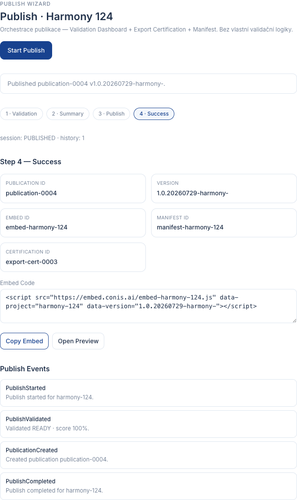

# EPIC-BX-06 — Publish Wizard Report

## Scope

Implemented Publish Wizard as the orchestration layer that closes the Builder Studio v1.0 publication loop.

The wizard answers:

> Is this project ready — and if so, publish it safely?

It does **not** invent validation rules. It uses:

- Validation Dashboard (`READY` gate)
- Export Certification (required reference)
- existing Manifest id (reference only)

## Delivered Components

| Component | Status |
|---|---|
| PublishWizardService | PASS |
| PublicationSession | PASS |
| PublishedArtifact | PASS |
| PublishStrategy / BasicPublishStrategy | PASS |
| PublishValidator | PASS |
| PublicationHistory | PASS |
| Publish Wizard UI | PASS |
| Events | PASS |
| API | PASS |
| Unit tests | PASS |

## Service / API

- `initialize()` / `startPublish()`
- `loadValidation()`
- `preparePublication()`
- `publish()` / `publishProject()`
- `finish()` / `dispose()`
- `findPublication()` / `findLatestPublication()` / `listPublications()`

## UI

Section: `Publish`

1. Validation — Ready Score, Blocking Issues, Warnings (Publish disabled unless READY + certification)
2. Summary — Project, Assets, Metadata, Manifest, Certification, Version
3. Publish — creates Published Artifact
4. Success — Publication ID, Version, Embed ID, Embed Code, Copy Embed, Open Preview

## Events

- `PublishStarted`
- `PublishValidated`
- `PublicationCreated`
- `PublishCompleted`
- `PublishFailed`

## Architecture rules

Publish Wizard:

- does not add own validation logic
- uses Validation Dashboard
- uses Export Certification
- uses existing Manifest references
- does not mutate Runtime
- does not use AI

## Architecture

```text
Project
  │
  ▼
Workspace
  │
  ▼
Assets
  │
  ▼
Object Metadata
  │
  ▼
Validation Dashboard
  │
  ▼
Publish Wizard
  │
  ▼
Published Artifact
```

## Verification

```text
npm run typecheck
PASS

npm test
PASS

npm run build
PASS
```

## Screenshot


