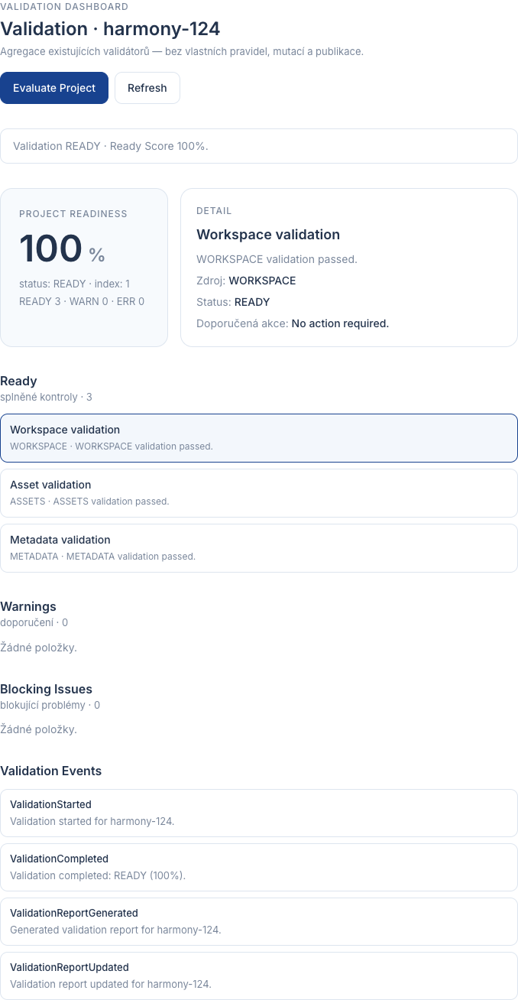

# EPIC-BX-05 — Validation Dashboard Report

## Scope

Implemented Validation Dashboard as the central readiness overview for a Builder project.

The dashboard does **not** replace specialized validators. It only aggregates their results into one report.

Aggregated sources:

- WorkspaceValidator (`WORKSPACE`)
- AssetValidator (`ASSETS`)
- MetadataValidator (`METADATA`)
- PublicationReadinessValidator (`PUBLICATION`)
- ExportCertificationValidator (`EXPORT`)
- optional `CUSTOM` checks (extension point without Dashboard API change)

## Model note

BLD-07 already exports quality-gate `ValidationReport`.

Epic deliverable names map as:

| Epic | Implementation |
|---|---|
| ValidationReport | `DashboardValidationReport` |
| ValidationCheck | `DashboardValidationCheck` |
| OverallStatus | `DashboardOverallStatus` (`READY` \| `WARNING` \| `BLOCKED`) |

Existing BLD-07 `ValidationDashboard` UI component remains the Publish quality-gate view. This EPIC adds section **Validation** via `ValidationOverview`.

## Delivered Components

| Component | Status |
|---|---|
| ValidationDashboardService | PASS |
| ValidationAggregator | PASS |
| ValidationReport (`DashboardValidationReport`) | PASS |
| ValidationCheck (`DashboardValidationCheck`) | PASS |
| ValidationIndex | PASS |
| Validation UI | PASS |
| Events | PASS |
| API | PASS |
| Unit tests | PASS |

## Service / API

- `initialize()`
- `evaluateProject()`
- `refresh()` / `refreshValidation()`
- `getValidationReport()` / `findValidationReport()`
- `listValidationReports()`
- `dispose()`

## UI

Section: `Validation`

- Project Readiness / Ready Score (%)
- Ready — splněné kontroly
- Warnings — doporučení
- Blocking Issues — blokující problémy
- Click item → detail (source, status, recommended action)

## Events

- `ValidationStarted`
- `ValidationCompleted`
- `ValidationReportGenerated`
- `ValidationReportUpdated`

## Architecture rules

Dashboard:

- does not invent validation rules
- does not mutate project / assets / metadata
- does not publish
- does not use AI

Session evaluation calls pure validators on current packages (or uses existing publication reports) and feeds snapshots into the aggregator.

## Architecture

```text
Project
  │
  ▼
Assets
  │
  ▼
Metadata
  │
  ▼
Validation Dashboard
  │
  ▼
Publish Wizard
```

## Verification

```text
npx tsc --noEmit
PASS

npm test
PASS

npm run build
PASS
```

## Screenshot


